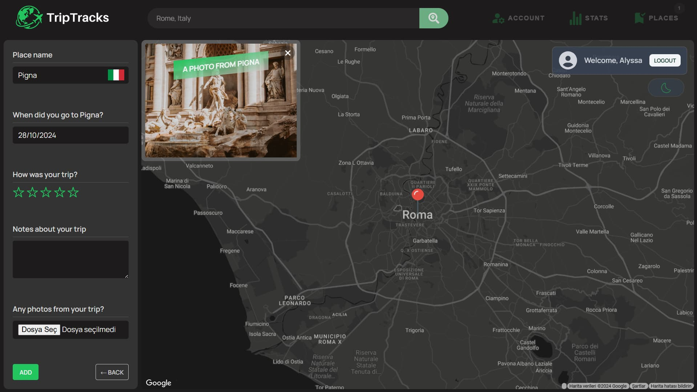

# TripTracks 🌍


**A location-tracking web application to record and share your favorite travel spots and memories.**

---

## Table of Contents

1. [About the Project](#about-the-project)
2. [Features](#features)
3. [Screenshots](#screenshots)
4. [Getting Started](#getting-started)

- [Prerequisites](#prerequisites)
- [Installation](#installation)

5. [Usage](#usage)
6. [API Documentation](#api-documentation)
7. [License](#license)
8. [Contact](#contact)

---

## About the Project

TripTracks is a location-based web application that lets users save, view, and manage their favorite travel locations worldwide. Perfect for travel enthusiasts, this app allows you to add personal notes and images to each location, creating a visual travel diary. With secure authentication and filtering options, **TripTracks** brings a personalized experience to tracking your travels.

## Features

- **Interactive Map Integration**: Mark any location with Google Maps.
- **User Authentication**: Secure sign-up, login, and authentication with JWT.
- **Personalized Details**: Add notes, dates, and images to each location.
- **Place Management**: Add, edit, and delete favorite places.
- **Account Management**: Update or delete your account securely.
- **Sorting and Filtering**: Toggle between ascending and descending sorting of saved locations.

---

## Screenshots

### Home Page


### Pricing Page


### Product Page


### Login Page


### Sign Up Page


### Map View


### Add Place



### Sorted and Filtered View


### Stats View


### Account Management


---

## Getting Started

Follow these instructions to get a local copy up and running

### Prerequisites

Make sure you have the following:

- **Node.js** v14+ and **npm** v6+.
- **MongoDB Atlas** account.
- **Render** account (if deploying to Render).

### Installation

1. **Clone the repository**:

   ```bash
   git clone https://github.com/aykinsancakli/triptracks.git
   cd TripTracks
   ```

2. **Install dependencies**:

Server dependencies:

```bash
cd server
npm install
```

Client dependencies:

```bash
cd client
npm install
```

3. **Set up environment variables** by creating a `.env` file in the root directory:

In server/.env:

```plaintext
MONGODB_URI=<your-mongodb-atlas-uri>
JWT_SECRET=<your-jwt-secret>
```

In client/.env:

```plaintext
REACT_APP_API_BASE_URL=http://localhost:5000
GOOGLE_MAPS_API_KEY=<your-google-maps-api-key>
```

4. **Start the server and client**:

   In the server folder:

   ```bash
   npm run dev
   ```

   In the client folder:

   ```bash
   npm run dev
   ```

---

## Usage

1. **Sign Up / Log In** to create an account.
2. **Explore the Map**: Click anywhere to add a new place.
3. **Add Details**: Add name, date, notes, and an image for each place.
4. **View Saved Places**: Access a list of saved places.
5. **Filter and Sort**: Organize your places by name or date.

---

## API Documentation

### Base URL

The API base URL for backend services is:
`https://<your-backend-service-url>`

### Endpoints

- **GET** `/api/check-auth` - Check authentication.
- **POST** `/api/signup` - Register a new user.
- **POST** `/api/login` - Log in an existing user.
- **POST** `/api/logout` - Logging out a user.
- **DELETE** `/api/delete-account` - Delete a user account.
- **GET** `/api/country/:name` - Get country data by name.
- **GET** `/api/country/:lat/:lng` - Get country data by latitude and longitude.
- **GET** `/api/weather/by-coordinates` - Get country data by coordinates.
- **GET** `/api/weather/time/by-coordinates` - Get time data by coordinates.
- **GET** `/api/weather/image` - Get image data.
- **GET** `/api/places` - Fetch all saved places for the authenticated user.
- **GET** `/api/places/:id` - Fetch a specific place by user id.
- **DELETE** `/api/places/:id` - Delete a place.
- **POST** `/api/places` - Add a new place.

---

## License

Distributed under the MIT License. See `LICENSE` for more information.

---

## Contact

Aykın Sancaklı - [sancakliaykin@gmail.com](mailto:sancakliaykin@gmail.com)  
Project Link: [GitHub Repository](https://github.com/aykinsancakli/triptracks)
